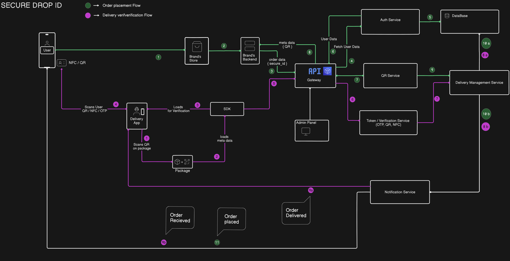

# SecureDrop 🛡️📦  

SecureDrop is a **Proof-of-Concept (PoC)** for a **secure delivery authorization system** that prevents package theft, fraud, and unauthorized access.  
It ensures **double verification** at the time of delivery using **QR codes, OTP, and NFC (future scope)**, empowering customers to stay in control of their deliveries.  

---

## 🔍 Problem  

Traditional delivery flows have critical flaws:  
- Customers receive packages without **identity verification**.  
- Delivery agents can **hand over packages to the wrong person**.  
- **Proxy acceptance** (neighbors, strangers, fraudsters) is possible.  
- One-time OTP alone isn’t enough — it can be leaked or misused.  

---

## 💡 Solution – SecureDrop  

SecureDrop introduces a **multi-factor delivery authorization**:  

1. **Order Tagging by Brand (B2B SDK)**  
   - At checkout, the brand’s system tags each package with a **unique SecureDrop ID + QR code**.  
   - The package is linked to the customer’s identity in the backend.  

2. **Delivery Agent Verification Flow**  
   - **Step 1**: Agent scans package QR → package status + owner identity fetched.  
   - **Step 2**: Agent requests verification from customer (via **QR scan / OTP / NFC card**).  
   - **Step 3**: If match = ✅ Authorized | else ❌ Rejected.  

3. **Customer Control**  
   - Customers approve/deny deliveries via the **B2C web app**.  
   - Can pre-approve deliveries for family/friends with dynamic access codes.  

---

## 🏗️ High-Level Architecture  

  

---

## 🔄 Workflows  

### 1. Order Placement & Tagging  
- Customer places order → Brand uses SecureDrop SDK → Package tagged with QR.  

### 2. Delivery Flow  
- Agent scans package QR → enters verification stage →  
- Customer provides OTP / NFC / scans package QR → Authorization result shown.  

### 3. Customer App Flow  
- Customers manage deliveries, approve/reject, generate temporary codes.  

---

## 📦 Deliverables  

### 🔹 B2B SDK (For Brands & Marketplaces)  
- **Order Tagging** → Generate and attach SecureDropID + QR to each package.  
- **Integration APIs** → Simple hooks to integrate with brand backend.  
- **Verification Hooks** → Allow brands to fetch delivery verification status.  
- **QR Service Integration** → Ensures every package has a unique, verifiable identity.  

### 🔹 B2C Web App (For Customers)  
- **Delivery Dashboard** → View and manage upcoming deliveries.  
- **Authorization Flow** → Approve/reject deliveries in real time.  
- **Multiple Factors** → Support for OTP, QR scan, NFC (future).  
- **Delegated Access** → Share temporary codes with trusted family/friends.  
- **Delivery History** → Audit trail of all past deliveries.  

---

## ⚙️ Tech Stack  

- **Frontend**: React / Next.js (Landing Page + B2C App)  
- **Backend**: Node.js / Express (Microservices)  
- **SDK**: Lightweight JS SDK for brand integration  
- **Database**: Firebase / MongoDB (PoC level)  
- **Auth & Security**: OTP, QR, future NFC integration  

---

## 🚀 Future Scope  

- 🔒 NFC Smart Cards (for seamless verification).  
- 🤖 AI-based anomaly detection (detect unusual delivery behavior).  
- 🔗 Blockchain-based audit trails for tamper-proof logs.  
- 📱 Native mobile apps for delivery agents & customers.  

---

## 📸 Demo & Screenshots  

- Landing Page (Pitch UI)  
- Customer App Screens (Approve/Reject, OTP, QR Scan)  
- Agent Flow (Double Scan Authorization)  

*(Add screenshots / links once hosted)*  

---

## 📜 License  

This project is released under the **MIT License** – feel free to fork and contribute.  

---

## 👤 Author  

**Hari Prasad**  
- 💼 [Portfolio](hari-prasad-portfolio.vercel.app)  
- 🌐 [LinkedIn](https://www.linkedin.com/in/hari-prasad-cit-it)  
- 🖥️ [GitHub](https://github.com/HARIPRASAD-2003)  
